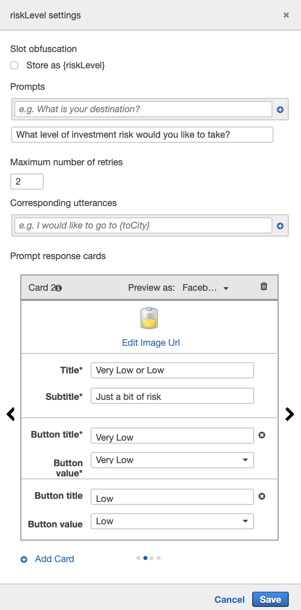

# unit13-challenge

## **Sailing for An Early Retirement!**
_**Option 1: Robo Advisor for Retirement Plans**_

A bot **RoboAdvisor** is built for retirement planning on Amazon Lex.


### _**Demo:**_

_**Scenario 1: when the provided age falls between 0 and 65 with an investment of at least $5000**_

_**Scenario 2: when investing less than $5000 or the age provided falls outside the range of 0 to 65**_


### _**Files**_

---

* [**Lambda Function**](RoboAdvisor/Code/lambda_function.py)

* [**Robot on Lex**](RoboAdvisor/Bot/RoboAdvisor_bot_lex.zip)

* [**Demo Video**](RoboAdvisor/Recording/RoboAdvisor_test.mov)

---

### _Details_

Two more utterances are added to those provided in the [instructions](Instructions/README.md) as follows:
* How to retire early and take ​{riskLevel}​ risk
* I need ​{investmentAmount}​ by ​{age}​ to retire

Recommendations are built under the `recommend_portfolio(intent_request)` function as follows:

```python
    """
    Performs dialog management and fulfillment for recommending a portfolio.
    """
    risk_level = get_slots(intent_request)["riskLevel"]
```

```python
    # define investment portfolio recommendations

"""
    Responses based on selected risk levels.
    """
    risk = {
        "None": "100% bonds (AGG), 0% equities (SPY)",
        "Very Low": "80% bonds (AGG), 20% equities (SPY)",
        "Low": "60% bonds (AGG), 40% equities (SPY)",
        "Medium": "40% bonds (AGG), 60% equities (SPY)",
        "High": "20% bonds (AGG), 80% equities (SPY)",
        "Very High": "0% bonds (AGG), 100% equities (SPY)"
    }
```

with initial recommendation
```python
# Get the initial investment recommendation
    initial_recommendation = risk[risk_level]
```


#### _Test Results on `Lambda Function`:_
<details><summary>
Results (click me):
</summary>


_Test Files (provided)_
* [correct_dialog.txt](RoboAdvisor/Code/Test_Cases/correct_dialog.txt)
* [age_error.txt](RoboAdvisor/Code/Test_Cases/age_error.txt)
* [incorrect_amount_error.txt](RoboAdvisor/Code/Test_Cases/incorrect_amount_error.txt)
* [negative_age_error.txt](RoboAdvisor/Code/Test_Cases/negative_age_error.txt)

</details>

#### _Customize `riskLevel` Slot_

<details><summary>
Prompt cards on risk levels (click me):
</summary>





</details>


#### _**Design on `RecommendPortfolio`** Intent:_

<details><summary>
Overview on Amazon Lex (click me):
</summary>


</details>


## **Next Steps**

* _**Construct post-confirmation intents use `get_slots` on `riskLevel` responses. The Confirmation Prompt box was unchecked on Amazon Lex intent builder as it "short-circuit" the trigger to select `riskLevel`.**_ 
    * If ordering becomes an issue, define a separate function `recommended_portfolios(risk)` shown below could be an alternative to the current risk dictionary defined under the function `recommend_portfolio(intent_request)`:
<details><summary>
Click me for details on an alternative function:
</summary>

```python
 # define investment portfolio recommendations
def recommended_portfolios(risk):
"""
Responses based on selected risk levels.
"""
risk = {
    "None": "100% bonds (AGG), 0% equities (SPY)",
    "Very Low": "80% bonds (AGG), 20% equities (SPY)",
    "Low": "60% bonds (AGG), 40% equities (SPY)",
    "Medium": "40% bonds (AGG), 60% equities (SPY)",
    "High": "20% bonds (AGG), 80% equities (SPY)",
    "Very High": "0% bonds (AGG), 100% equities (SPY)"
    }
    return risk[risk_level]
```
It follows that the `initial_recommendation` defined under the current `recommend_portfolio(intent_request)` function becomes:
```python

# Get the initial investment recommendation
    initial_recommendation = recommended_portfolios(risk)
```
</details>

* _**Deploy RoboAdvisor on Facebook or Slack on `Channels` tab using Amazon Lex Documentations**_
    * Graphic analyzers are available under `Monitoring` tab on Lex


## References

* Columbia University GitLab Repository
* https://docs.aws.amazon.com/lex/latest/dg/gs2-prepare.html
* https://docs.aws.amazon.com/lex/latest/dg/additional-exercises.html
* https://hackernoon.com/building-a-serverless-chatbot-with-aws-lex-lambda-and-amazon-aurora-part-1-5406e8db6123
* https://chatbotsmagazine.com/quick-start-develop-a-chat-bot-with-aws-lex-lambda-part-1-b6f7c80ebba6
* https://medium.com/velotio-perspectives/amazon-lex-aws-lambda-beyond-hello-world-1403c1825e72
* https://docs.aws.amazon.com/lex/latest/dg/example1.html
* https://docs.aws.amazon.com/lex/latest/dg/gs-cli-publish-bot.html
* https://docs.aws.amazon.com/lex/latest/dg/fb-bot-association.html
* https://www.iconfinder.com/
* CloudApp - Screen Recorder
* QuickTime Player
